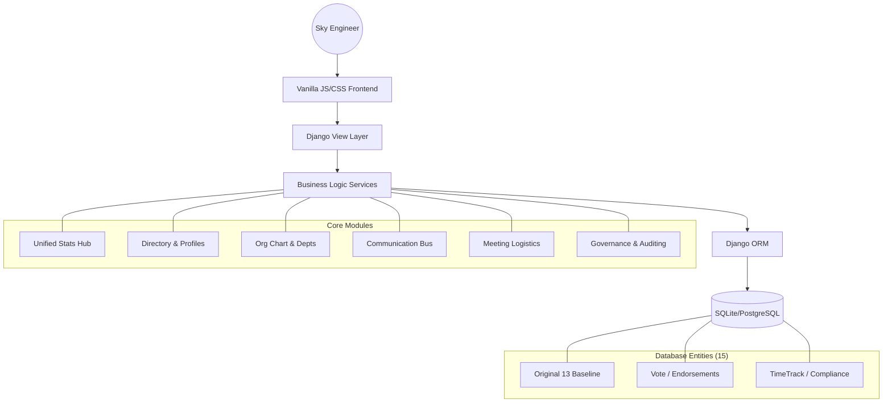

# Sky Engineering Team Registry

  
   
  
<b>The High-Fidelity Source of Truth for Sky Engineering</b>

  
  
  
  
  

---

## Vision & Overview
The **Sky Engineering Team Registry** is a mission-critical platform designed to map, manage, and visualize the complex hierarchy of engineering teams across Sky. Built on a "High-Fidelity" design philosophy, it serves as the central intelligence surface for cross-team dependencies, internal communications, and organizational transparency.

## System Architecture

## High-Fidelity Features & "Design Spells"
*   **Intelligence Surface (Dashboard):** Real-time monitoring of team health and organizational volume.
*   **Global Semantic Search:** Debounced AJAX-powered engine for instant discovery of teams and leads.
*   **Team Endorsements (Voting):** Social signal system for team recognition and peer support.
*   **Logistics Visualization:** Monthly and Weekly toggles for engineering release and meeting coordination.
*   **Architectural Visualization:** Interactive dependency mapping and hierarchical org charts linking to detailed department profiles.
*   **Design Spells (Micro-interactions):** Production-grade UI details including interactive card tilts, glassmorphism shine effects, and status-pulsing indicators.
*   **Traceability (Audit Log):** Every mutation is recorded via Django signals for complete governance.

## Access Control
| User Type | Credentials | Key Capability |
| :--- | :--- | :--- |
| **Admin** | `admin` / `Admin1234!` | Full system governance, audit access, and entity management. |
| **Engineer** | `maurya.patel` / `Sky1234!` | View dependencies, manage meetings, and use internal messaging. |
| **Guest** | `testuser` / `Test1234!` | Read-only access to team and department directories. |

## Technical Specifications
- **Language:** Python 3.12 (Strict typing focus)
- **Framework:** Django 4.2 LTS (MVC Architecture)
- **Design:** "Sky Spectrum" Vanilla Design System
- **Patterns:** Signal-based auditing, Debounced AJAX Search, Glassmorphic UI
- **Deployment:** Ready for WSGI/Gunicorn production environments

## Engineering Leads (Group Project)
| Student | Name | Module Specialization |
| :--- | :--- | :--- |
| **Student 4** | **Maurya Patel** | **Lead Architect / Auth / Dashboard / Schedule** |
| **Student 1** | **Riagul Hossain** | **Directory & Profile Systems** |
| **Student 2** | **Lucas Garcia Korotkov** | **Org Chart & Dependency Visualization** |
| **Student 3** | **Mohammed Suliman Roshid** | **Messaging Service Bus** |
| **Student 5** | **Abdul-lateef Hussain** | **Reports & Audit Governance** |

## Development Quickstart
1.  **Environment Setup:** `python -m venv venv` and `source venv/bin/activate`
2.  **Dependencies:** `pip install -r requirements.txt`
3.  **Bootstrap:** `python manage.py migrate` and `python manage.py populate_data`
4.  **Launch:** `python manage.py runserver`

---
© 2026 Sky UK Limited. Developed as part of Academic Coursework. INTERNAL USE ONLY.
