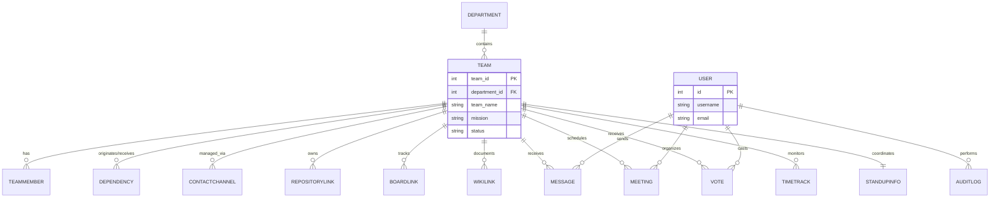

# Sky Engineering Registry: Comprehensive Database Specification

This document provides a technical deep-dive into the relational architecture of the Sky Engineering Team Registry. It mappings every field, key, and relationship for the 15 database entities implemented in Coursework 2.

---

## 🏗️ Relational Architecture Overview

---

## 📄 Entity-by-Entity Technical Map

### 1. User (The Identity Provider)
*   **Purpose**: Centralized authentication and role tracking.
*   **Keys**:
    *   `id`: **Primary Key (PK)** - Auto-incremented integer.
*   **Fields**: `username`, `first_name`, `last_name`, `email`, `is_staff`, `date_joined`.
*   **Connections**: Acts as the `actor` for Audit Logs and the `sender` for Messages.

### 2. Department (The Org Root)
*   **Purpose**: High-level grouping of engineering capabilities (e.g., Content, OTT, Cloud).
*   **Keys**:
    *   `department_id`: **Primary Key (PK)** - Auto-incremented integer.
*   **Fields**: `department_name`, `department_lead_name`, `description`.
*   **Connections**: Parent to multiple **Teams** (One-to-Many).

### 3. Team (The Central Nexus)
*   **Purpose**: The primary entity around which all registry data revolves.
*   **Keys**:
    *   `team_id`: **Primary Key (PK)** - Auto-incremented integer.
    *   `department_id`: **Foreign Key (FK)** - Connects to `Department.department_id`.
*   **Fields**: `team_name`, `mission`, `lead_email`, `status`, `tech_tags` (CSV), `work_stream`, `project_codebase`.
*   **Relational Logic**: If a Department is deleted, its Teams are removed (`on_delete=CASCADE`).

### 4. TeamMember (Human Capital)
*   **Purpose**: Individual engineers assigned to a specific team.
*   **Keys**:
    *   `member_id`: **Primary Key (PK)**
    *   `team_id`: **Foreign Key (FK)** - Connects to `Team.team_id`.
*   **Fields**: `full_name`, `role_title`, `email`.

### 5. Dependency (Network Topology)
*   **Purpose**: Maps cross-team relationships (Upstream/Downstream).
*   **Keys**:
    *   `dependency_id`: **Primary Key (PK)**
    *   `from_team_id`: **Foreign Key (FK)** - Origin team.
    *   `to_team_id`: **Foreign Key (FK)** - Target team.
*   **Fields**: `dependency_type` (Choice: Upstream/Downstream).

### 6. ContactChannel (Comms Interop)
*   **Purpose**: Diversified communication routes (Slack/Teams).
*   **Keys**:
    *   `channel_id`: **Primary Key (PK)**
    *   `team_id`: **Foreign Key (FK)** - Connects to `Team.team_id`.
*   **Fields**: `channel_type`, `channel_value`.

### 7-9. Links (Repo / Board / Wiki)
*   **Purpose**: Technical metadata tracking for DevOps integration.
*   **Structure**: 
    *   **PK**: `repo_id` / `board_id` / `wikki_id`.
    *   **FK**: `team_id` (All cascade with the Team).
*   **Fields**: `url`, `name`, `description`.

### 10. StandupInfo (Agile Metadata)
*   **Purpose**: Daily sync coordination.
*   **Relationship**: **One-to-One** with `Team`.
*   **Logic**: Every team has exactly one standup schedule to prevent scheduling conflicts.

### 11. Message (Communication Bus)
*   **Purpose**: Asynchronous internal communication.
*   **Keys**:
    *   `message_id`: **Primary Key (PK)**
    *   `sender_user_id`: **Foreign Key (FK)** - Connects to `User.id`.
    *   `team_id`: **Foreign Key (FK)** - Target `Team.team_id`.
*   **Fields**: `message_subject`, `message_body`, `message_status` (`draft`/`sent`).

### 12. Meeting (Calendar Logic)
*   **Purpose**: Event coordination.
*   **Keys**:
    *   `meeting_id`: **Primary Key (PK)**
    *   `created_by_user_id`: **Foreign Key (FK)**
    *   `team_id`: **Foreign Key (FK)**
*   **Fields**: `start_datetime`, `end_datetime`, `platform_type`, `agenda_text`.

### 13. AuditLog (Governance)
*   **Purpose**: Automated tracking of all system mutations.
*   **Keys**:
    *   `audit_id`: **Primary Key (PK)**
    *   `actor_user_id`: **Foreign Key (FK)** - Uses `on_delete=models.SET_NULL` to preserve history if a user is deleted.
*   **Fields**: `action_type` (Create/Update/Delete), `entity_type` (String), `summary`.

### 14. Vote (Peer Endorsement)
*   **Purpose**: Social validation of team performance.
*   **Keys**:
    *   `vote_id`: **Primary Key (PK)**
    *   `voter_id`: **Foreign Key (FK)** -> `User.id`.
    *   `team_id`: **Foreign Key (FK)** -> `Team.team_id`.
*   **Logic**: `unique_together = ('voter', 'team')` ensures integrity (one vote per member).

### 15. TimeTrack (Compliance)
*   **Purpose**: Formal milestone and delivery tracking.
*   **Keys**:
    *   `track_id`: **Primary Key (PK)**
    *   `team_id`: **Foreign Key (FK)** -> `Team.team_id`.
*   **Fields**: `milestone_name`, `status`, `scheduled_date`, `actual_date`.

---

## 🔐 Data Integrity Rules

| Mechanism | Description | Example |
| :--- | :--- | :--- |
| **CASCADE** | Deleting a parent removes all children. | Deleting a **Team** deletes all its **Messages**. |
| **SET_NULL** | Keeps child records but breaks the link. | Deleting a **User** keeps **AuditLog** entries (labeled as 'System/None'). |
| **Unique Constraints** | Prevents duplicate logical entries. | `StandupInfo` uses a One-to-One link to ensure only 1 sync per team. |

---
© 2026 Sky Engineering | Technical Documentation Team
